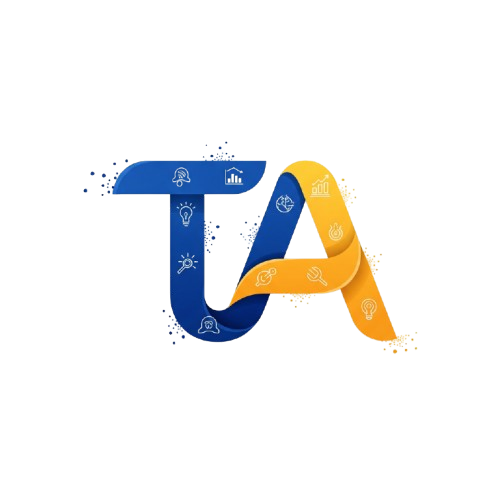

# Trio AI by Optima AI Inc

Trio AI is a powerful, open-source coding agent with a massive 256k context window. Fast, private, and fully under your control—built for developers who want the best AI coding experience on their own machine.

More info at: [https://optimaai.cc/](https://optimaai.cc/)

## 🚀 Features

- 🧠 **Trio AI Model**: Advanced coding agent with a huge 256k context window.
- ⚡️ **Local-first**: Fast, private, and no lock-in.
- 🛠 **Bring your own keys**: Use your own AI API keys with no vendor lock-in.
- 🖥️ **Cross-platform**: Easy to run on Windows or Mac.

## 📦 Download

No sign-up required. Just download and go.

### [👉 Download for your platform](https://optimaai.cc/#download)

**Trio AI** is open source (Apache 2.0-licensed).

If you're interested in contributing to Trio AI, please read our [contributing](./CONTRIBUTING.md) doc.
